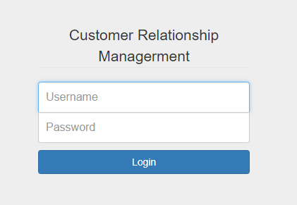
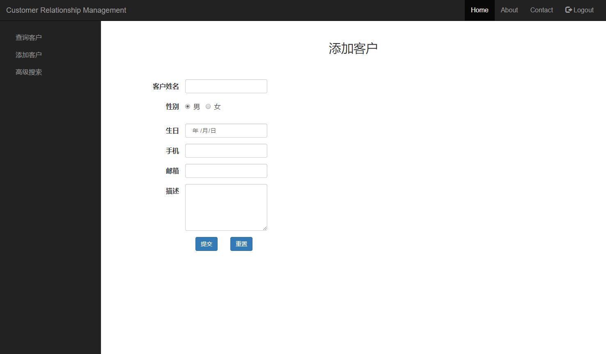
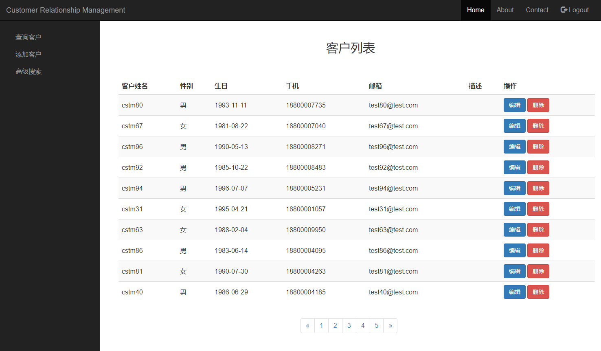
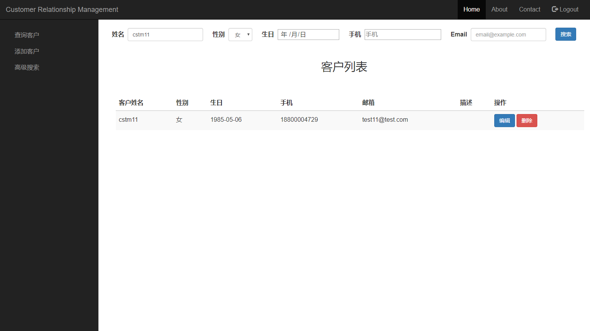
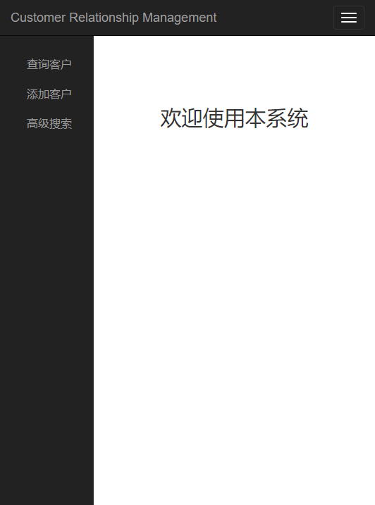

## SimpleCRM 简单客户管理系统

### 项目简介

本项目是一个简单的客户管理系统，是一个javaweb小项目。

采用了JDBC，数据库连接池，自定义转发servlet类，jsp，bootstrap等技术实现。

### 功能介绍

- 登录功能

用filter实现用户验证

- 添加客户

- 查询客户

查询数据库中所有客户，将查询结果以列表的形式给出并实现分页功能，能够对列表中的客户信息进行编辑和删除

- 高级搜索

多条件查询数据库中客户，将查询结果以列表的形式给出，能够对列表中的客户信息进行编辑和删除

- 响应式设计

前端采用bootstrap实现响应式设计

### 使用技术

- 数据库连接池c3p0
- `ThreadLocal`控制JDBC事务
  - 为空表示没有事务，不为空表示有事务
  - 开启事务时，需要赋值
  - 开启事务时，让dao层的多个方法共享这个`ThreadLocal`中的连接
  - 关闭事务时，需要移除

- 自定义支持事务的`TxQueryRunner`类
  - 该类继承自`QueryRunner`
  - 自行控制JDBC连接

- 将map对象直接封装到bean对象
  - 内部利用`apache.commons.beanutils`的`populate`方法实现

- 自定义一个`BaseServlet`执行指定Servlet方法，并简化转发和重定向等操作
  - 内部用反射获取希望调用的Servlet方法并执行
  - 通过约定的字符串格式，判断进行转发或重定向等操作